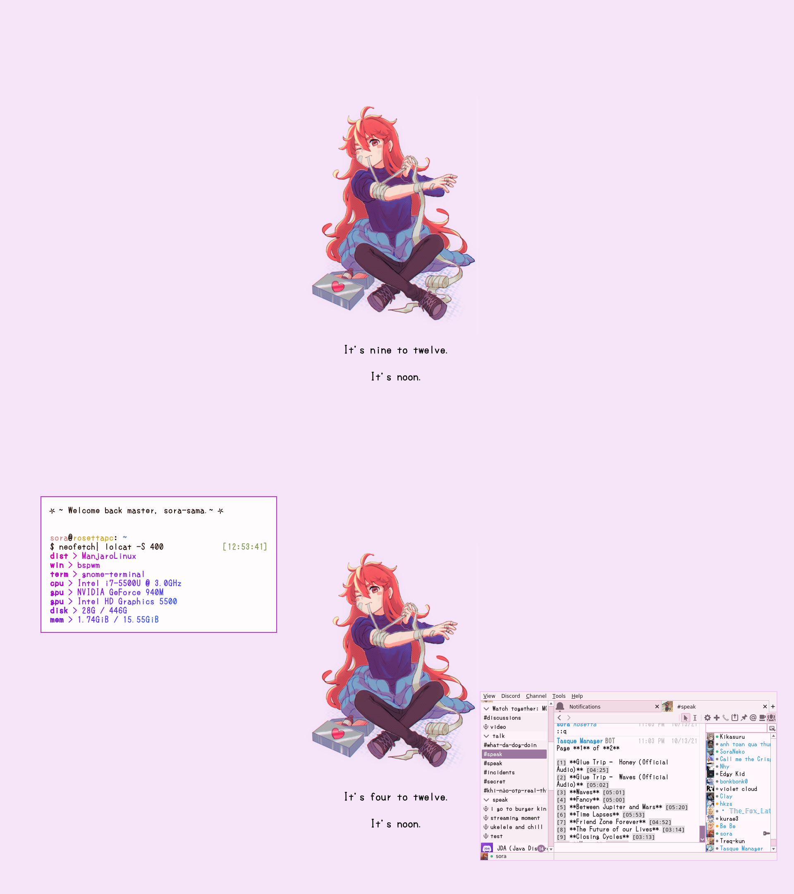

# dotfiles
Contain the customization I made for my Linux rice.



# Credit and Respect
- [Polybar Autohide](https://github.com/arkeane/polybar_autohide)
- [Fulltime](https://github.com/skyventuree/fulltime)
- [Rofi by adi1090x](https://github.com/adi1090x/rofi) (only include my personal
	references)

[Oh-my-ZSH](https://ohmyz.sh/) must be manually installed.

Wallpaper art by @iloli_i8g. [Click here](https://twitter.com/iloli_i8g/status/1417188835746729990) to see the original tweet.

Configuration files from [tam-carre dotfiles](https://github.com/tam-carre/dotfiles) & [lucypoulton dotfiles](https://github.com/lucypoulton/dotfiles/).

If you have problem with any content I re-uploaded here, feel free to create an
Issue and I'll work it out immediately.

# Installation
You must use an AUR helper to install the following packages:
``bspwm sxhkd dunst neovim ranger cava eww neofetch rofi flameshot feh  picom-ibhagwan-git polybar-git pulseaudio-ctl ttf-fluentui-system-icons gnome-terminal betterlockscreen``

Some packages can be replaced at will.

Copy everything from the repo to your home directories and make changes if needed.

Do `fc-cache -fv` to apply the fonts

Apply `gnome-terminal-settings.dconf` to GNOME-Terminal by
```
dconf load /org/gnome/terminal/ < gnome-terminal-settings.dconf
```
Make sure `dconf` is installed on your system.

**NOTE:** Some username instance must be renamed (`sora` in this case), please double check if anything goes wrong.

**NOTE 2**: You need to reconfig some stuff to make it work properly. Life isn't that easy.

# License
MIT.
